# IBM Cloud Private 3.2.1 와 MCM 3.2.1 설치하기

자세한 내용은 [Link](https://www.ibm.com/support/knowledgecenter/en/SSBS6K_3.2.1/installing/install_containers.html) 참고

설치 과정은 크게 6단계로 진행됩니다.

1. Boot Node에 Docker 설치
2. 설치 환경 셋업
3. 클러스터 커스터마이징 (추가 설정)
4. 클러스터 노드에 Docker 셋업
5. 환경 배포
6. 설치 확인

## Step 0: Pre-requisite 확인
https://www.ibm.com/support/knowledgecenter/SSBS6K_3.2.1/installing/prep_cluster.html

클러스터를 구성할 모든 노드에 대해 다음의 설정이 되어 있는지 확인합니다.

1. 각 노드에 대해 `/etc/hosts` 파일 설정
    1. IP 주소 및 host name 을 추가  (Loopback 주소인 127.0.0.1 로는 설정 불가하며, 각 ip 주소를 입력해야 함)
    2. `127.0.1.1`과 `::1 localhost` 라인은 comment out 합니다.

    ```bash
    127.0.0.1       localhost
    # 127.0.1.1     <host_name>
    # The following lines are desirable for IPv6 capable hosts
    #::1     localhost ip6-localhost ip6-loopback
    ff02::1 ip6-allnodes
    ff02::2 ip6-allrouters
    <master_node_IP_address> <master_node_host_name>
    <worker_node_1_IP_address> <worker_node_1_host_name>
    <worker_node_2_IP_address> <worker_node_2_IP_host_name>
    <proxy_node_IP_address> <proxy_node_host_name>
    ```

    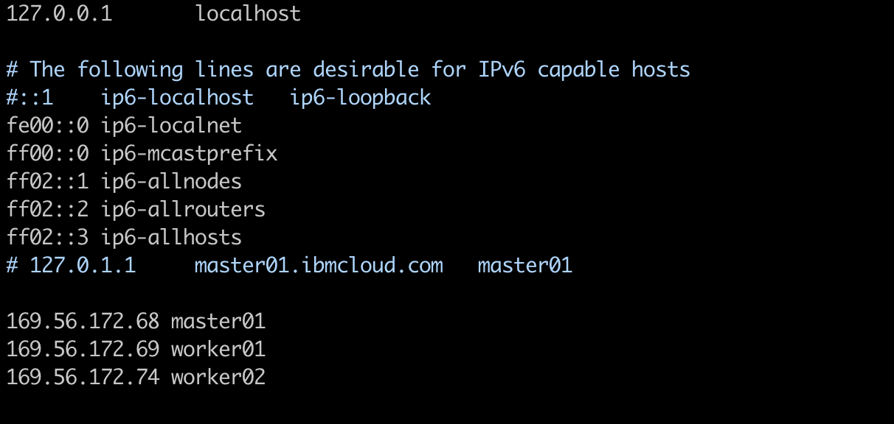

2. 노드 간 네트워크 통신이 가능한지 확인
3. Python 이 각 노드에 설치되어 있는지 확인 (Python 2 - versions 2.6 혹은 2.7 과 Python 3 - version 3.5 이상이 지원됩니다)

    ```bash
    python --version
    ```

## Step 1: Docker 를 boot node 에 설치

Boot Node 는 일종의 Inception Node 의 역할을 합니다. 클러스터 설치, 업그레이드, 노드 추가 등 클러스터 환경을 관리하는 역할을 하는 노드입니다.

ICP 설치시, Boot Node 에만 Docker를 설치하면 나머지 Node 에는 자동으로 Docker 엔진을 설치하도록 되어 있습니다.
이 때, [ICP 에서 지원하는 Docker 버전](https://www.ibm.com/support/knowledgecenter/SSBS6K_3.2.1/supported_system_config/supported_docker.html)을 사용해야 합니다.

Docker 설치 방법에 대한 상세 내용은 다음 [링크](https://www.ibm.com/support/knowledgecenter/SSBS6K_3.2.1/installing/install_docker.html#manual)를 참고하세요.

1. Docker를 설치할 Node에서 패키지 매니저가 패키지 업데이트를 할 수 있도록 설정되어 있는지 확인합니다. (RHEL - RPM, Ubuntu - Apt)
2. Node 에 대한 Docker 패키지를 다운로드 합니다. ([IBM Cloud Private Docker packages](https://www.ibm.com/support/knowledgecenter/SSBS6K_3.2.1/supported_system_config/supported_docker.html#packages))
3. Docker를 설치합니다. (Linux 기준)

    ```bash
    chmod +x icp-docker-18.09.7_x86_64.bin
    sudo ./icp-docker-18.09.7_x86_64.bin --install
    ```

    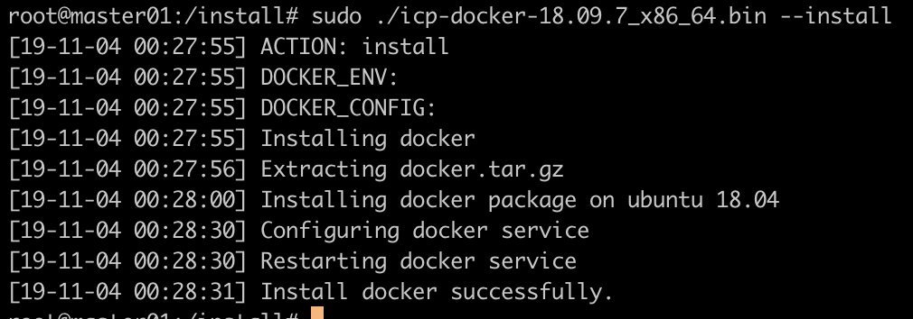

4. Docker 가 성공적으로 설치되었는지 확인합니다.

    ```bash
    sudo systemctl start docker
    sudo systemctl status docker
    ```

    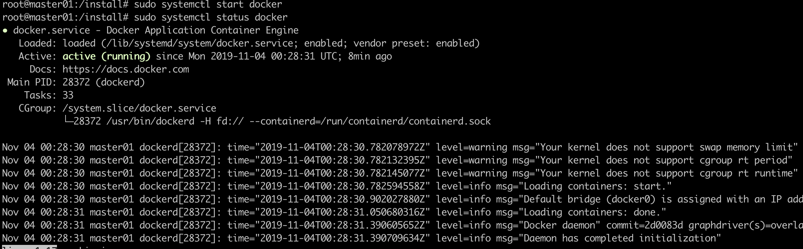

## Step 2: 설치 환경 셋업

1. root 권한을 가진 사용자로 boot node에 로그인합니다.
2. IBM Cloud Private 설치파일이 맞게 다운로드 되었는지 확인합니다. - Linux x86_64 클러스터의 경우 ,  ibm-cloud-private-x86_64-3.2.1.tar.gz

3. 이미지 추출 후 Docker 로 로드합니다. (Linux x86_64 기준이며, 이미지 로드시 시간 소요됨)

   ```bash
   tar xf ibm-cloud-private-x86_64-3.2.1.tar.gz -O | sudo docker load
   ```

   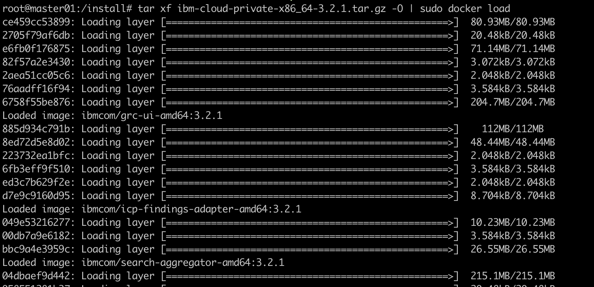

4. 설치 디렉토리를 생성합니다. (설치 디렉토리는 최소 50GB 이상의 디스크 용량이 가용해야 합니다)

    ```bash
    sudo mkdir /opt/ibm-cloud-private-3.2.1;
    cd /opt/ibm-cloud-private-3.2.1
    ```

5. 인스톨러 이미지로부터 설정 파일을 추출합니다.

    ```bash
    cd /opt/ibm-cloud-private-3.2.1/
    ```

    ```bash
    sudo docker run -v $(pwd):/data -e LICENSE=accept \
    ibmcom/icp-inception-amd64:3.2.1-ee \
    cp -r cluster /data
    ```

6. boot node로부터 다른 node로의 통신을 위해 SSH 연결 설정을 합니다. ([상세 내용](https://www.ibm.com/support/knowledgecenter/SSBS6K_3.2.1/installing/ssh_keys.html))
   1. boot node에 root 권한으로 로그인합니다.
   2. SSH Key 를 생성합니다.

        ```bash
        ssh-keygen -b 4096 -f ~/.ssh/id_rsa -N ""
        ```

   3. 생성한 SSH Key 를 각 cluster node에 추가합니다. 클러스터 노드는 master, worker, proxy, management, Vulnerability Advisor (VA) node 등이 있습니다. 아래의 스텝을 각 노드의 ip 주소마다 수행합니다.  
   boot node로부터 SSH public key 를 클러스터 노드로 추가하기

        ```bash
        ssh-copy-id -i ~/.ssh/id_rsa.pub <user>@<node_ip_address>
        ```

      \<user\> 는 노드의 사용자이름 (root)이며, <node_ip_address>는 클러스터 노드의 IP 주소

    4. `/<installation_directory>/cluster` 폴더에 자동으로 생성된 `ssh_key`파일을 다른 클러스터 노드와 통신할 때 사용하는 private key file 로 변경합니다.

    ```bash
    sudo cp ~/.ssh/id_rsa /opt/ibm-cloud-private-3.2.1/cluster/ssh_key
    ```

7. 각 클러스터 노드의 IP 주소를 `/opt/ibm-cloud-private-3.2.1/cluster/hosts`파일에 추가합니다.
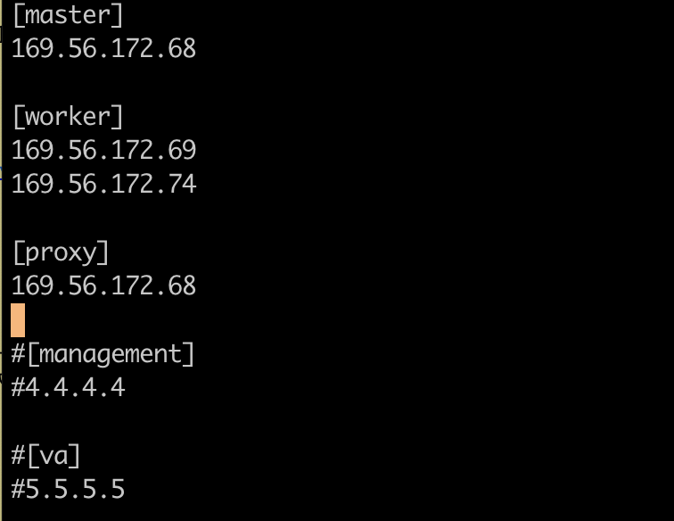

8. ICP 설치 이미지 파일을 `/<installation_directory>/cluster/images` 폴더로 이동합니다.
    1. 이미지 디렉토리 생성

        ```bash
        sudo mkdir -p /<installation_directory>/cluster/images
        ```

        ```bash
        sudo mkdir -p /opt/ibm-cloud-private-3.2.1/cluster/images
        ```

    2. 설치 이미지를 images 디렉토리 하위로 이동합니다. <installation_image_directory> 는 기존에 설치파일이 있던 경로

    ```bash
     sudo mv <installation_image_directory>/ibm-cloud-private-x86_64-3.2.1.tar.gz /opt/ibm-cloud-private-3.2.1/cluster/images/
    ```

    ```bash
     sudo mv /install/ibm-cloud-private-x86_64-3.2.1.tar.gz /opt/ibm-cloud-private-3.2.1/cluster/images/
    ```

## Step 3: 클러스터 커스터마이즈

`/<installation_directory>/cluster/`하위에 있는 `config.yaml` 파일을 수정하여 클러스터 배포시 설정값을 수정할 수 있습니다.

1. 디폴트 패스워드 변경 - 저는 데모 용도이기에 패드워드 규칙을 비활성화 하려고 합니다.

    ```yaml
    password_rules:
    - '(.*)'
    ```

    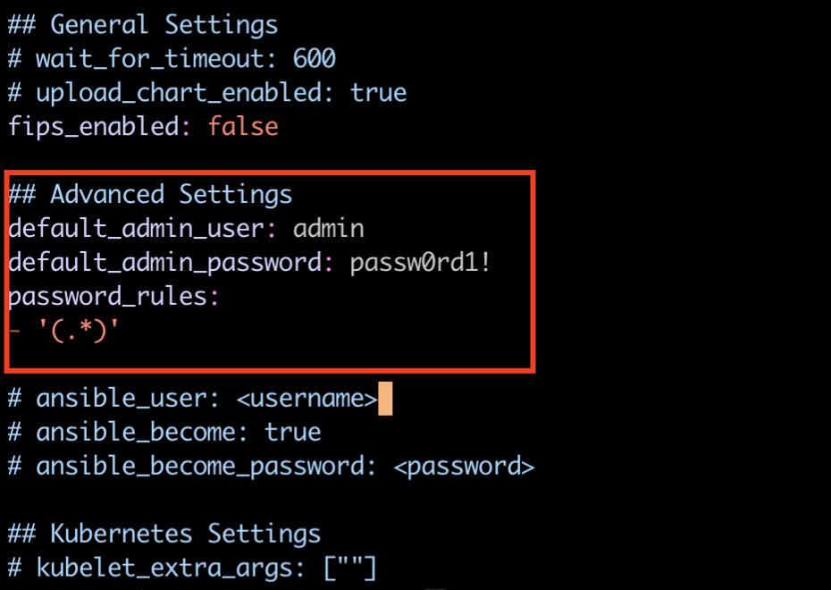

1. 클러스터 이름 변경하기
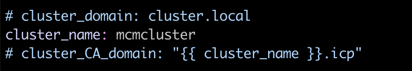

1. 저는 MCM (Multi cloud Manager) 기능을 활성화 할 것이므로, 아래와 같이 설정을 변경해줍니다. [상세 링크 참고](https://www.ibm.com/support/knowledgecenter/SSBS6K_3.2.1/installing/config_mcm_ce.html)

    1. `single_cluster_mode: false` 로 변경

    ```yaml
    single_cluster_mode: false
    ```

    2. persistent storage 사용을 위해 다음과 같이 로컬 스토리지 설정

        ```yaml
        multicluster-hub:
          etcd:
            persistence: true
            localPath: /var/lib/etcd-mcm
        ```

        그 다음 management node (management node가 없다면 master ndoe) 로 로그인하여 `/var/lib/etcd-mcm` 디렉토리를 생성합니다.
        ```bash
        mkdir /var/lib/etcd-mcm 
        ```

        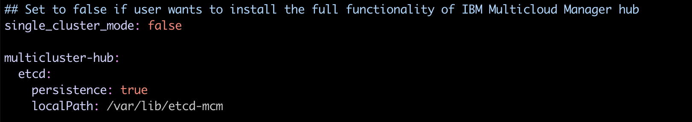

    그 외 상세 설정은 다음 [링크](https://www.ibm.com/support/knowledgecenter/SSBS6K_3.2.0/installing/config_yaml.html)를 참고하여 로그 설정, 네트워크 설정, Kubernetes 설정 등을 할 수 있습니다.

## Step 5 : 환경 배포하기

1. `cluster` 디렉토리로 위치를 변경하여 다음의 명령을 실행합니다.

    ```bash
    cd /<installation_directory>/cluster
    ```

    ```bash
    cd /opt/ibm-cloud-private-3.2.1/cluster
    ```

1. 환경 배포하기 (백그라운드로 실행) :

    ```bash
    sudo nohup docker run --net=host -t -e LICENSE=accept \
    -v "$(pwd)":/installer/cluster ibmcom/icp-inception-amd64:3.2.1-ee install &
    ```

    위의 명령어 실행 후, 설치 과정 확인

    ```bash
    tail -f nohup.out
    ```

    설치시 에러가 확인되는 경우, 다음과 같이 다시 에러 메세지를 확인하는 옵션을 추가하여 배포합니다.

    ```bash
    sudo docker run --net=host -t -e LICENSE=accept -v "$(pwd)":/installer/cluster ibmcom/icp-inception-amd64:3.2.1-ee healthcheck
    ```

약 1시간 정도 걸려 설치가 완료 되었습니다. 설치 완료 후에는 다음과 같은 메세지가 나옵니다. 
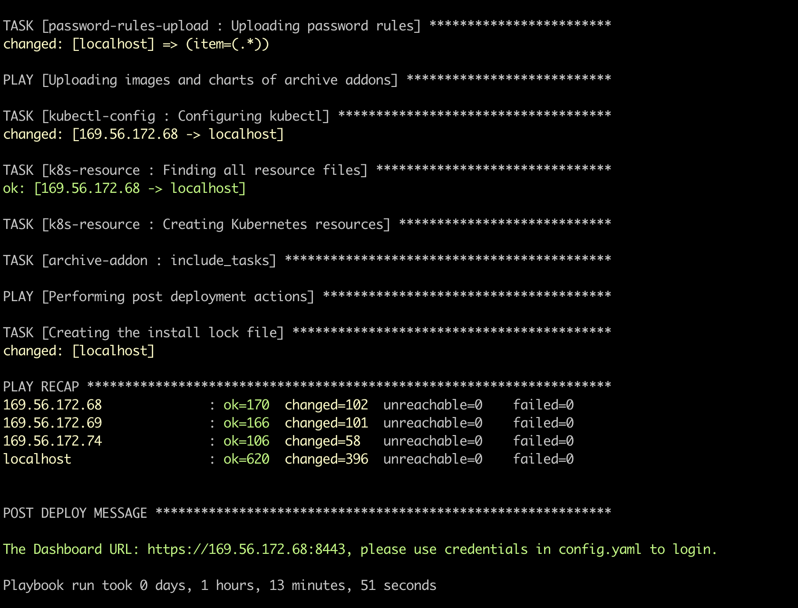

출력된 URL 을 복사, 브라우저 주소창에 붙여넣기 합니다.

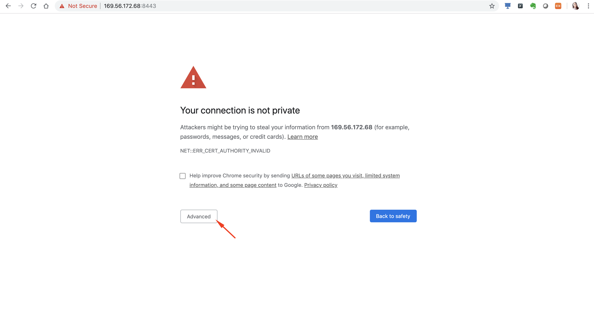
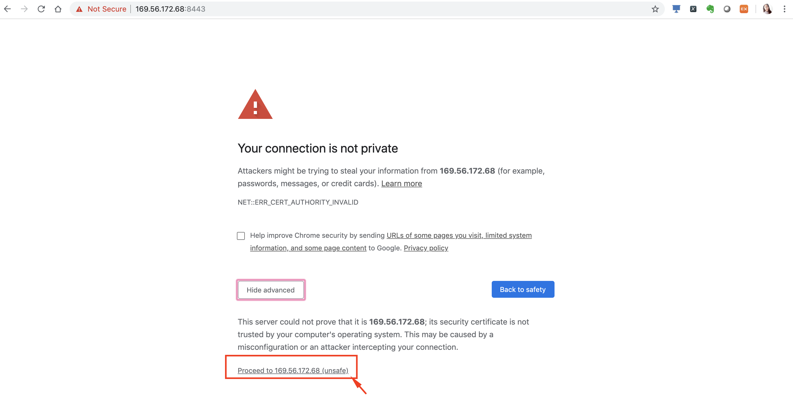

`config.yaml` 파일에서 설정해놓았던 관리자 username / password 를 입력하여 로그인합니다.

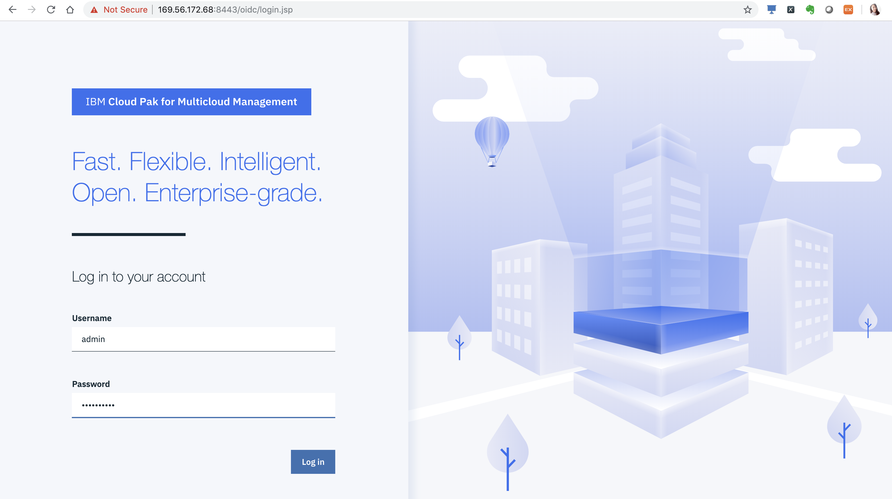
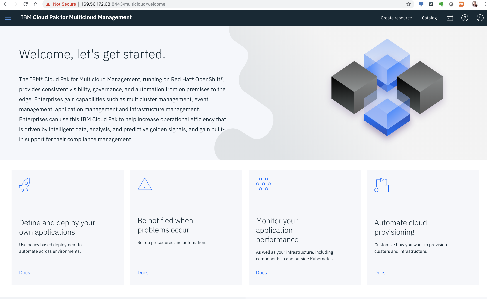

이제 설치가 완료 되었습니다.
